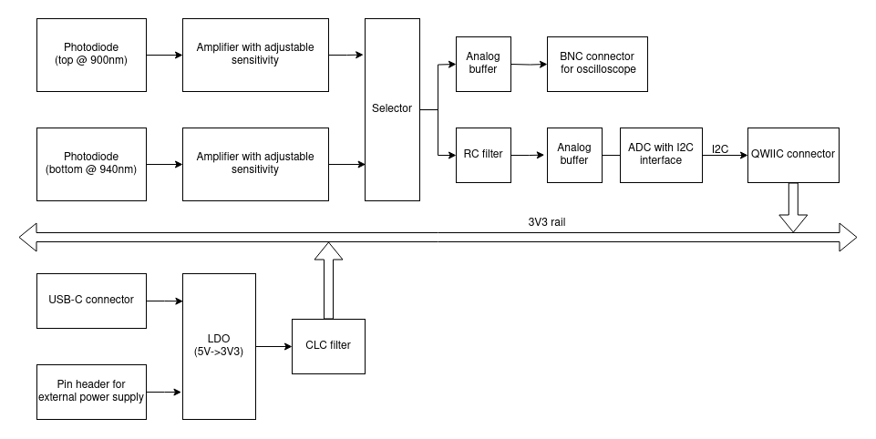

# IR Irradiance Probe

Copyright (c) 2022-2023 [Antmicro](https://www.antmicro.com)

## Overview

This project is designed to measure irradiance of IR sources. Its main interface for measurements reading is I2C, however it also exposes BNC connector as an output for oscilloscope.

The design files were preapared in KiCad 6.x.

## Key features

* Two photodiodes for measuring IR irradiance (peak sensitivity @ 900nm for diode on top and 940nm for the bottom one)
* BNC connector for oscilloscope measurements
* Regulated sensitivity
* I2C single-channel interface
* Selectable power source (USB-C / JST / external power supply)

## Block diagram

